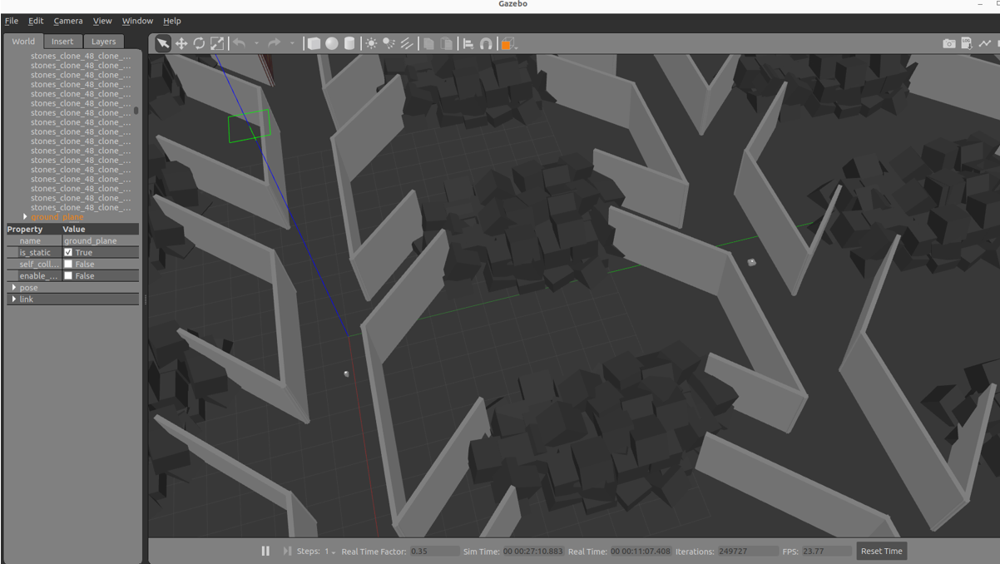
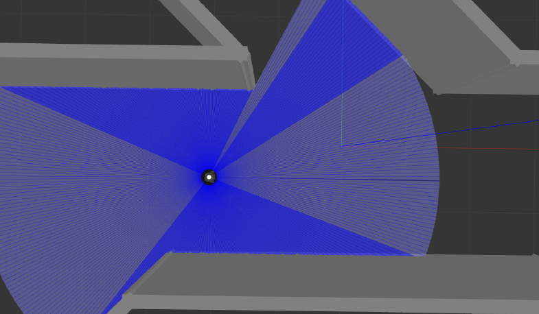
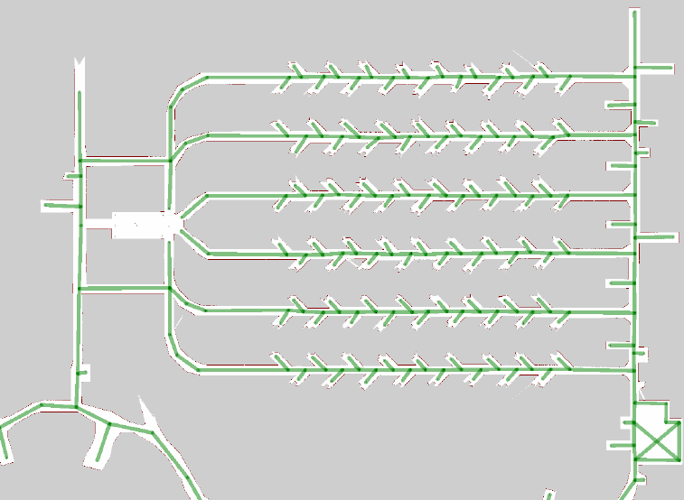
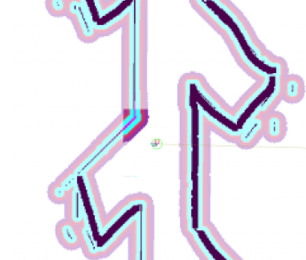

# **OpenRMF – Multi-Robot Coordination and SLAM with ROS2**

### **Project Overview**

This repository contains the implementation of my Master’s thesis project at Politecnico di Torino, focused on multi-robot coordination and autonomous navigation using ROS2 and OpenRMF
The system enables multiple robots to:

- Navigate autonomously in complex environments
- Coordinate tasks efficiently
- Perform real-time obstacle detection
- Generate maps using LiDAR-based SLAM (Cartographer ROS2)

Simulations were designed to generate, analyze, and validate data, ensuring the reliability of the system in real-world-like scenarios.

### **Architecture & Methodology**

The system is organized into modular components for scalability and maintainability:

1. ROS2 Nodes
   - Python and C++ nodes for navigation, obstacle detection, and task scheduling

2. Mapping & SLAM
   - Environment mapping using Cartographer ROS2

3. Multi-Robot Coordination
   - Task allocation and coordination with OpenRMF and OpenTCS

4. Simulation & Validation
   - Gazebo for 3D environment simulation
   - RViz for visualization and monitoring

### **Results & Demonstrations**

- Real-time multi-robot coordination in simulated environments
- Environment maps generated with LiDAR
- Navigation and obstacle avoidance validated through data logging and visualization

